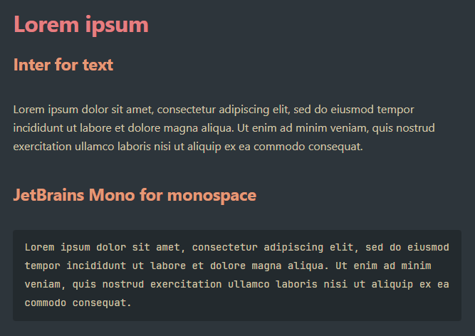

# JetBrains Mono Obsidian CSS Snippet
[jetbrains-mono-font-monospace-theme.css](jetbrains-mono-font-monospace-theme.css) is an [Obsidian CSS snippet](https://help.obsidian.md/Extending+Obsidian/CSS+snippets) that sets Obsidian's monospace font to [JetBrains Mono](https://www.jetbrains.com/lp/mono).



## How to use

> [!note]
> The following instructions written for Windows desktop. They are likely similar on other platforms but have not been tested.

To use the CSS snippet:

1. In Obsidian, open **Settings**.
2. Under **Appearance → CSS snippets**, click **Open snippets folder** (folder icon).
3. In the opened snippets folder, copy in [jetbrains-mono-font-monospace-theme.css](jetbrains-mono-font-monospace-theme.css).
4. In Obsidian, under **Appearance → CSS snippets**, click **Reload snippets** (refresh icon).
5. To the right of the new **jetbrains-mono-font-monospace-theme** entry, click the toggle to enable the snippet.

## FAQ

### You can already set the font in Obsidian's settings. When is this useful?

This CSS snippet is useful when:

1. You use [Obsidian Sync](https://obsidian.md/sync) to sync settings (notably CSS snippets) across multiple devices; and
2. You want to ensure the same font is displayed correctly regardless of which fonts are actually installed on your devices.

### How can I change the font to something else?

A tool such as https://transfonter.org can be used to Base64 encode a font. Base64 encoding the font produces a CSS file where the font data is embedded within a `@font-face` definition.

The `@font-face` definition in [jetbrains-mono-font-monospace-theme.css](jetbrains-mono-font-monospace-theme.css) needs to be replaced with your new definition and the `--font-monospace-theme` definition in the `body` element needs to be updated:

```css
body {
    --font-monospace-theme: 'NEW FONT NAME';
}
```

### How can I have this also change the text font and the interface font?

Obsidian has a few [intrinsic site font CSS variables](https://docs.obsidian.md/Reference/CSS+variables/Publish/Site+fonts) including `--font-monospace-theme`. New definitions for `--font-text-theme` and `--font-interface-theme` need to be included in the `body` element of [jetbrains-mono-font-monospace-theme.css](jetbrains-mono-font-monospace-theme.css):

```css
body {
    --font-text-theme: 'JetBrains Mono';
    --font-monospace-theme: 'JetBrains Mono';
    --font-interface-theme: 'JetBrains Mono';
}
```

## Licensing and attributions

This repo has an [Unlicense license](LICENSE.md) as I've only really aggregated data rather than producing something novel.

This repo also includes the [JetBrains Mono's OFL.txt](JetBrainsMonoOFL.txt) which is copied from https://github.com/JetBrains/JetBrainsMono/blob/master/OFL.txt.
